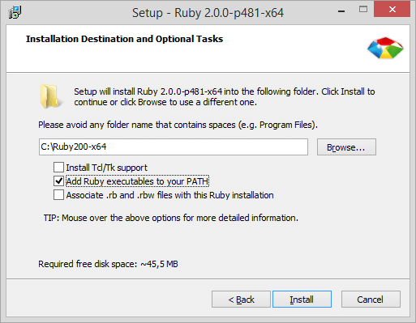
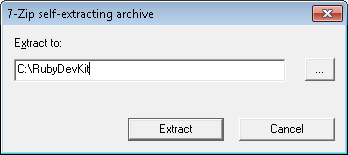
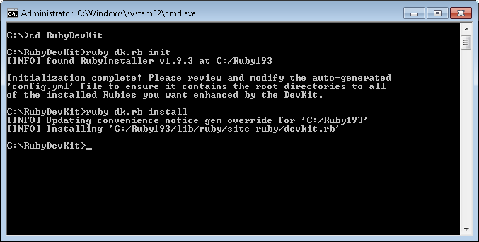

## What is Jekyll?
[Jekyll](http://jekyllrb.com/) is a blog-aware static site generator powered by Ruby. A static site generator takes a set templates and raw text files, runs it through a converter and renderer, then generates a plain HTML website that's ready to publish on any web server.

The blog-award part means that blogging is part of Jekyll’s functionality. We can publish and maintain a blog by simply managing a folder of text files. 

With Jekyll, we can build a blog, a portfolio, or any website that has a series of post entries without having to depend on a database or content management system. That's because Jekyll doesn't require setting up a complex application on a web server like WordPress, Ruby on Rails, or Flask. Instead, all the development magic happens on your computer. When Jekyll is done, it gives you a set of regular web pages that you can upload to any server. 

####Jekyll on Windows

While Windows is not an officially-supported platform, it can be used to run Jekyll with the proper tweaks.The installation process is very straight forward.

####Install Ruby

1. Download and install [the latest RubyInstaller](http://rubyinstaller.org/downloads/) for your version of Windows. Execute the installer and go through the steps of the installation. When you get to the screen below, make sure to check the “Add Ruby executables to your PATH” box.

      

    Click Install and Ruby will be installed within seconds.

2. [Download the Ruby DevKit](http://rubyinstaller.org/downloads/) matching the version of Ruby you installed.

3. When you execute the file, it’ll ask you for a destination for the files. Enter a path that has no spaces in it. Like this: `DevKit-mingw64-64-4.7.2-20130224-1432-sfx.exe` to `C:\RubyDevKit`.

      

4. Locate the Ruby `2.0.0-p598-x64 folder` in the Windows Start Menu and open `Start Command Prompt with Ruby`

5. Initialize the DevKit and bind it to your Ruby installation. Open your command line tool and navigate to the folder you extracted the DevKit into.

        cd C:\RubyDevKit  

    Auto-detect Ruby installations and add them to a configuration file for the next step.

        ruby dk.rb init  

    Install the DevKit, binding it to your Ruby installation.

        ruby dk.rb install  

      

####Install Jekyll

 To install Jekyll and all its default dependencies, launch your command line tool and enter the following command:

    gem install jekyll

## Known installation issues
There are currently no reported issues.  If you are having one, please report it in the [Treehouse forum](https://teamtreehouse.com/forum/q:jekyll).